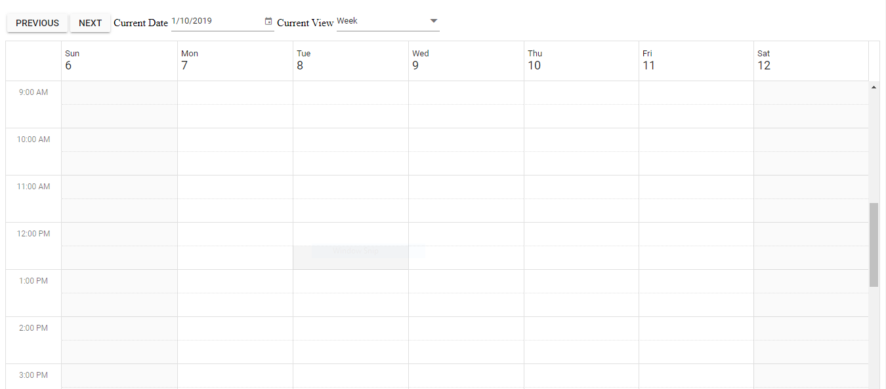

# Syncfusion Angular 11 Scheduler with perform navigation and view change operation in code behind
This project helps you to create a Angular Scheduler with code behind navigation and view change operation.



## Scheduler features covered in this Project

This is an Angular 11 project created using [Angular CLI](https://github.com/angular/angular-cli) version 11.0.2. The Scheduler features included in this project are as follows.
* Angular 11 Scheduler with applying custom text to toolbar today item based on view.
* Angular 11 Scheduler displaying basic views with appointments loaded as TS data.
* Drag and resize actions enabled for events by default.
* Setting selected date and view for scheduler.

## How to run this application?
To run this application, you need to first clone this project repository and then navigate to its appropriate path where it has been located in your system.

## Installing
Once done with downloading, next you need to install the necessary packages required to run this application locally. The `npm install` command will install all the needed angular packages into your current project and to do so, run the below command.

```
npm install
```

## Running on development server
Run `ng serve` for a dev server. Navigate to `http://localhost:4200/`. The app will automatically reload if you change any of the source files.

## Further help

To get more help on the Angular CLI use `ng help` or go check out the [Angular CLI README](https://github.com/angular/angular-cli/blob/master/README.md).