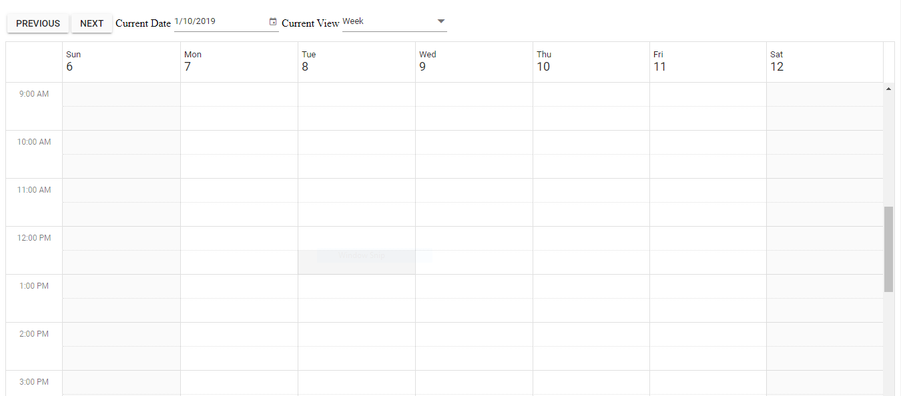

# Syncfusion Angular 11 Scheduler with perform navigation and view change operation in code behind

**Repository Description:** This project demonstrates how to create a professional Angular Scheduler application with advanced code-behind navigation and view change operations. It showcases best practices for implementing dynamic scheduler functionality using Angular 11 and TypeScript, enabling developers to build responsive scheduling applications with custom toolbar behaviors and flexible event management.



## Scheduler features covered in this Project

This is an Angular 11 project created using [Angular CLI](https://github.com/angular/angular-cli) version 11.0.2. The Scheduler features included in this project are as follows.
* Angular 11 Scheduler with applying custom text to toolbar today item based on view.
* Angular 11 Scheduler displaying basic views with appointments loaded as TS data.
* Drag and resize actions enabled for events by default.
* Setting selected date and view for scheduler.

## Prerequisites

Before running this application, ensure you have the following installed on your system:
* Node.js (v12 or higher)
* Angular CLI version 11.0.2 or compatible
* npm or yarn package manager
* A modern web browser with ES6 support

## How to run this application?

To run this application, you need to first clone this project repository and then navigate to its appropriate path where it has been located in your system.

## Installing
Once done with downloading, next you need to install the necessary packages required to run this application locally. The `npm install` command will install all the needed angular packages into your current project and to do so, run the below command.

```
npm install
```

## Running on development server
Run `ng serve` for a dev server. Navigate to `http://localhost:4200/`. The app will automatically reload if you change any of the source files.

## Documentation

For comprehensive documentation and resources, refer to the following links:

* **Syncfusion Angular Introduction:** https://ej2.syncfusion.com/angular/documentation/introduction
* **Syncfusion Schedule Component:** https://ej2.syncfusion.com/angular/documentation/schedule/getting-started
* **Angular CLI Documentation:** [Angular CLI README](https://github.com/angular/angular-cli/blob/master/README.md)

## Additional Resources

For more help and support:
* Use `ng help` for Angular CLI assistance
* Visit the [Angular Documentation](https://angular.io/docs) for framework-specific information
* Check the documentation links above for Syncfusion scheduler features and capabilities

## Support

For issues or questions about this project, refer to the official documentation links above or contact Syncfusion support.